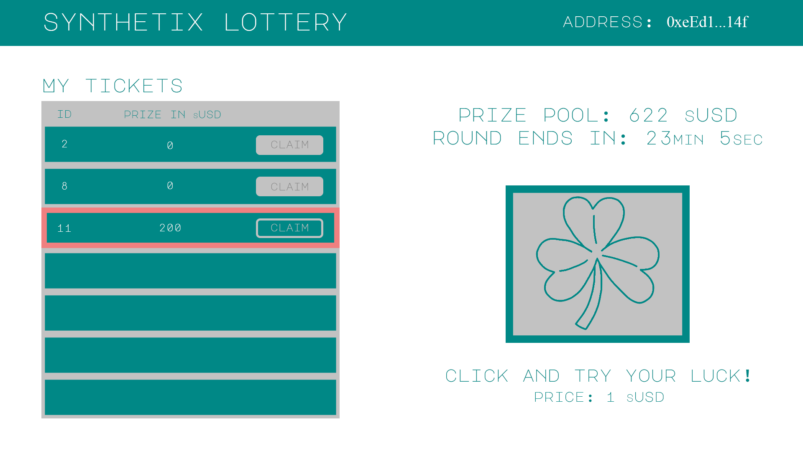

### Synthetix Lottery

This project has been developed as part of Open DeFi Hackathon:  
https://gitcoin.co/issue/snxgrants/open-defi-hackathon/8/100025689

## About

Synthetix Lottery lets users buy tickets with their sUSD. Tickets are represented as NFTs, minted upon purchase. Since tickets conform to ERC721, they can be transfered and claimed by the current holder. Ticket price is fixed to 1 sUSD. Every round of lottery lasts for limited amount of time. In addition, to successfully finish round, at least 3 tickets must be bought. Then, anyone can call `selectRoundWinners` function which will use Chainlink's VRF to randomly select 3 winners. Owners of tickets can claim their prize at any point. As soon as round finishes and winning tickets are selected new round starts.

## Implementation

All the functionality is implemented in Lottery.sol. It extends from ERC721 and VRFConsumerBase. Each ticket is represented as standard NFT token, with following parameters:

```
    struct Ticket {
        bool isWinning;
        bool isClaimed;
        uint256 prize;
    }
```

`isWinning` - false by default, true if ticket is selected for prize when round is finished  
`isClaimed` - false by default, true if prize is claimed  
`prize` - prize is sUSD which is avaiable to ticket owner

There are 3 main external functions available to users:

**buyLotteryTicket**

Lets user buy lottery ticket. It will mint new NFT and return ticket ID to the user. Currently cost of the ticket is fixed to 1 sUSD. That also means that user needs to approve Lottery to spend its sUSD prior to buying new ticket. Prize pool is then updated with new sUSD.

**selectRoundWinners**

This function will end the current round and randomly select 3 winners using Chainlink's VRF. Prizes are:

- 1st: 50% of the prize pool
- 2nd: 35% of the prize pool
- 3rd: 15% of the prize pool

Anyone can call this function, however there are some prerequisites for it:

- at least `roundDuration` amount of time passed since round start. In current implementation it is fixed to 6 hours
- there are at least 3 tickets bought in this round
- contract has enough LINK to request randomness

Contract will request radnomness via VRF coordinator. There is one exception - when contract is running in local development network, no VRF is called, but pseudo-randomness is generated locally. Selecting 3 random winners from single random number received from VRF is done by additional hashing (performed locally) of given number and nonce.

Prizes are calculated for winners and made available for claiming. New round is now ready to start automatically - pointer to the first ticket of new round is updated, along with the new round end-time. Prize pool also resets to 0 sUSD.

**claimPrize**

Lets user to claim his prize. Owner of the ticket will be transfered his prize sUSD. Tickets are NFT tokens which means that prize-claimer doesn't have to be initial buyer of the ticket.

## Frontend mockup


## Test

There is a set of test cases that can be used to verify all the functionalities in local network. Make sure Ganache is running.

After cloning the project, next step is to install dependencies:

```
npm install
```

Then compile and deploy contract to development network:

```
truffle migrate network --development
```

Finally start automated test cases

```
$ truffle test
...
  Contract: Lottery
    ✓ has correct initial state (272ms)
    ✓ lets user to buy lottery ticket (898ms)
    ✓ selects lottery winners (1907ms)
    ✓ allows users to claim prizes (315ms)
    ✓ allows claims of transfered tickets (456ms)
    ✓ runs multiple rounds (1923ms)


  6 passing (9s)
```

## Deploy to testnet

Currently contract is deployed to Kovan testnet. It can always be re-deployed:

```
truffle migrate --network kovan
```

Assumption is that there are `.secret` and `.endpoint` files created in dapp root directory which contain mnemonic phrase and Infura endpoint for Kovan network, respectively.

